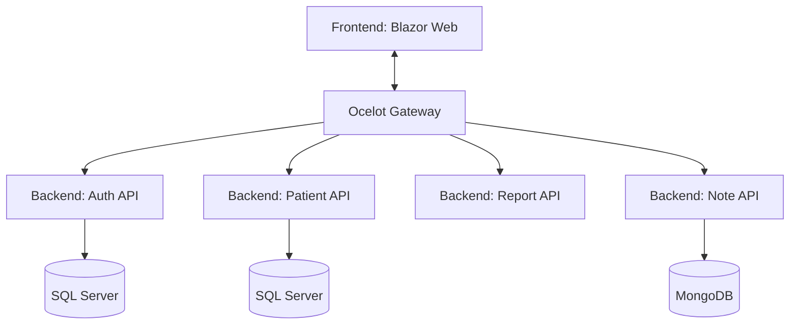

Diagramme représentant l'architecture de l'application :

```mermaid
	graph TD;
	Ocelot[Ocelot Gateway]  -->  AuthService[Backend: Auth API]
	Ocelot[Ocelot Gateway]  -->  PatientService[Backend: Patient API]
	Ocelot  -->  ReportService[Backend: Report API]
	Ocelot  -->  NoteService[Backend: Note API]
	AuthService  -->  DbAuth[(SQL Server)]
	PatientService  -->  DbPatient[(SQL Server)]
	NoteService  -->  DbNote[(MongoDB)]
	Client[Frontend: Blazor Web]  <-->  Ocelot
```
