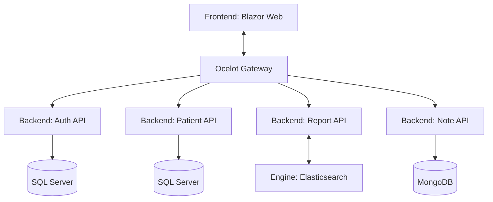

Ce projet vise à gérer les patients par un organisateur, permettre la prise de notes par un praticien, et évaluer le risque de diabète chez les patients.

D'un point de vue technique, l'objectif est de développer une application reposant sur une architecture en microservices, en intégrant une base de données NoSQL pour la gestion des notes.

Diagramme représentant l'architecture de l'application :

## Prérequis
- .NET 9.0
- Docker 27.4.x : https://www.docker.com/

## Installation
Installer Docker

1. Cloner le projet 
	```
	git clone https://github.com/bpodwinski/DotNetprojet10.git
	```
2. Dans le répertoire du projet utiliser docker compose pour créer les images et lancer les conteneurs docker :
	```
	docker compose up
	```
## Utilisation

Pour accéder à l'application : [https://localhost:8081](https://localhost:8081)

Un compte **Super Admin** est créé par défaut pour vous connecter :
- **Identifiant** : `admin`
- **Mot de passe** : `Ls7N0U7tmZ48!`

Quatre patients sont déjà créés, chacun avec une note et un niveau de rapport différent. À vous de tester l'application et d'explorer ses fonctionnalités !
