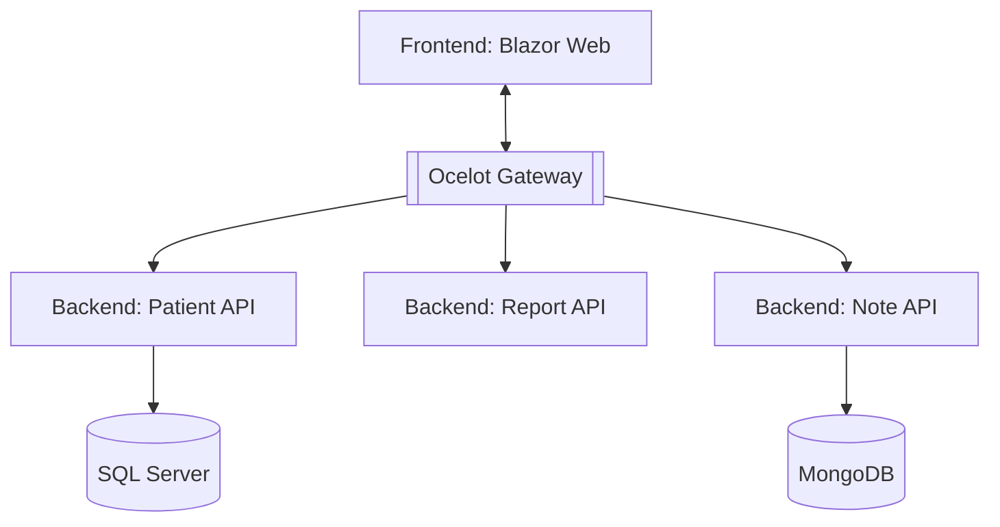

Diagramme représentant l'architecture de l'application :

```mermaid
	graph TD;
	Ocelot[[Ocelot Gateway]]  -->  PatientService[Backend: Patient API]
	Ocelot  -->  Rapport-Diabete[Backend: Report API]
	Ocelot  -->  NoteService[Backend: Note API]
	PatientService  -->  SQL[(SQL Server)]
	NoteService  -->  MongoDB[(MongoDB)]
	Client[Frontend: Blazor Web]  <-->  Ocelot
```
